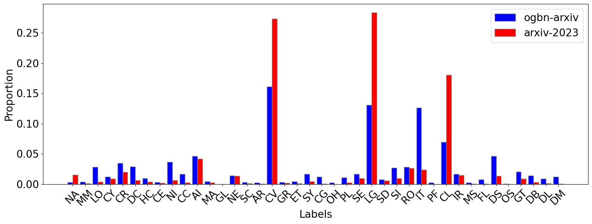

# Can LLMs Effectively Leverage Graph Structural Information: When and Why

[](https://arxiv.org/abs/2309.16595)

We provide three main components:

- A new dataset `arxiv-2023`, whose test nodes are chosen from arXiv Computer Science (CS) papers published in 2023.
- A unified dataloader for `cora`, `pubmed`, `ogbn-arxiv`, `arxiv-2023` and `ogbn-product` as well as their raw text.
- A simple template for testing ChatGPT on these datasets. See `template.ipynb`.


## 1. New Dataset: `arxiv-2023`

`arxiv-2023` is collected to be compared with `ogbn-arxiv`. Both datasets represent directed citation networks where each node corresponds to a paper published on arXiv and each edge indicates one paper citing another.


#### Statistics of  `ogbn-arxiv` and `arxiv-2023` datasets

| Dataset      | #Nodes (Full Dataset) | #Edges (Full Dataset) | In-Degree/Out-Degree (Test Set) | Average Degree (Test Set) | Published Year (Test Set) |
| ------------ | --------------------- | --------------------- | ------------------------------- | ------------------------- | ------------------------- |
| `ogbn-arxiv` | 169343                | 1166243               | 1.33/11.1                       | 12.43                     | 2019                      |
| `arxiv-2023` | 33868                 | 305672                | 0.16/10.6                       | 10.76                     | 2023                      |


#### Proportional distribution of labels in `ogbn-arxiv` and `arxiv-2023` datasets. Each label represents an arXiv Computer Science Category.



## 2. Unified Dataloader for Datasets and Raw Text

### Download Datasets and Raw Text

We provide the dataset and raw text for `arxiv-2023` in this repo. You may need to download the dataset and raw text for other datasets.

- `cora` and `pubmed`: download [here](https://github.com/XiaoxinHe/TAPE). and place the datasets at `/dataset/cora/` and `/dataset/pubmed/` respectively.
- `ogbn-arxiv` and `ogbn-product`: as you run the dataloader, `ogb` will automatically download the dataset for you. But you need to download the raw text by yourself. For `ogbn-arxiv`, download [here](https://snap.stanford.edu/ogb/data/misc/ogbn_arxiv/titleabs.tsv.gz) and place the file at `/dataset/ogbn_arxiv/titleabs.tsv`. For `ogbn-product`, download [here]( https://drive.google.com/file/d/1gsabsx8KR2N9jJz16jTcA0QASXsNuKnN/view?usp=sharing) and place the folder at `/dataset/ogbn-products/Amazon-3M.raw`


### Set up environment and OpenAI API key

You need to set up your OpenAI API key as `OPENAI_API_KEY` environment variable. See [here](https://help.openai.com/en/articles/5112595-best-practices-for-api-key-safety) for details.

Required packages include `openai`, `pytorch`, `PyG`, `ogb` etc.


### Data Loading API

```python
>>> from utils.utils import load_data
>>> data, text = load_data("arxiv_2023", use_text=True)
>>> print(data)
Data(x=[33868, 128], edge_index=[2, 305672], y=[33868, 1], paper_id=[33868], train_mask=[33868], val_mask=[33868], test_mask=[33868], num_nodes=33868, train_id=[19461], val_id=[4682], test_id=[668])
>>> print(text.keys())
dict_keys(['title', 'abs', 'label', 'id'])
```


## Citation

If you find this repo helpful for your research, please consider citing our paper below.

```latex
@misc{huang2023llms,
      title={Can LLMs Effectively Leverage Graph Structural Information: When and Why}, 
      author={Jin Huang and Xingjian Zhang and Qiaozhu Mei and Jiaqi Ma},
      year={2023},
      eprint={2309.16595},
      archivePrefix={arXiv},
      primaryClass={cs.LG}
}
```

